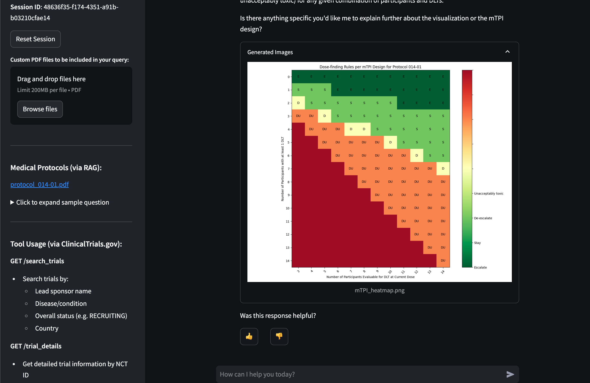

# 🧰 AWS Bedrock Multi-Agent Blueprint

A blueprint for building sophisticated multi-agent applications powered by AWS Bedrock.

## Overview

This solution enables seamless deployment of collaborative AI agents that can reason, analyze data, and interact with external tools. Built on AWS CDK, it provides a complete infrastructure featuring vector search capabilities, comprehensive observability, secure authentication, and an intuitive interface. Perfect for developers looking to leverage the full potential of AWS Bedrock's AI capabilities in a scalable, secure, and observable way 🚀

**[🎦 Watch a demo walkthrough of the application examples and the user interface](https://www.youtube.com/watch?v=C4E9A4qw0tU)**

**[🤓 Watch a technical walkthrough of the project setup and implementation details](https://www.youtube.com/watch?v=6WUlxm-Rffs)**

This is a screenshot of the [Streamlit](https://streamlit.io/) application in action:

<a href="images/application.png"></a>

## Architecture Diagram

<a href="diag/architecture.png"></a>

## Key Features

- 🤖 **Multi-Agent Architecture**: Built with AWS Bedrock Agents including a Supervisor Agent, RAG Agent and Tools Agent working together seamlessly as a multi-agent system
- 🔍 **Knowledge Base Integration**: Leverages AWS Bedrock Knowledge Base for intelligent processing of PDF documents via RAG
- 🔄 **Tools Calling Integration**: Custom Bedrock Action group for fetching and analyzing relevant clinical trials data from ClinicalTrials.gov using AWS Lambda
- 🧮 **Code Interpreter**: Built-in Code Interpreter capabilities for data analysis and visualization tasks that is able to generate images and HTML code
- 🎯 **Prompt Engineering**: Custom prompt templates and configurations for knowledge base responses and orchestration of the Bedrock Agents
- 📊 **Vector Database Storage**: Uses Amazon Aurora Vector Store for efficient storage and retrieval of embeddings for RAG
- 📈 **Observability**: Built-in monitoring and tracing with LangFuse integration for evaluation, tracing, and cost tracking
- 🛠️ **Infrastructure as Code**: Complete AWS CDK v2 for TypeScript setup with projen for consistent infrastructure management
- 🔐 **Authentication**: Integrated Cognito-based authentication system for secure access control to the application via username / password
- 💻 **Streamlit App**: Interactive web interface built with Streamlit for easy interaction with the agents deployed to AWS ECS Fargate
- 📚 **OpenAPI Schema**: Automatically generated from annotated code of your Lambda function using Lambda Powertools for Bedrock
- 📄 **File Upload**: Support for uploading and analyzing custom PDF files directly in the chat interface

## Setup and Usage

1. Login to your AWS account, go to AWS Bedrock Model catalog in us-east-1 region and request access to the following models:
   - Titan Text Embeddings V2
   - Claude Sonnet 3.5 v1
2. Eventually, you may need to increase your AWS account limits / service quota for Claude [as described here](https://docs.aws.amazon.com/bedrock/latest/userguide/quotas.html)
3. Register a free LangFuse account for observability at [LangFuse](https://langfuse.com/) and create a new project called `multi-agent-blueprint`. Then create a new AWS Secret named `langfuse/api`  that stores the public and private API key as JSON:
   ```json
   {
     "LANGFUSE_PUBLIC_KEY": "<YOUR_PUBLIC_API_KEY>",
     "LANGFUSE_SECRET_KEY": "<YOUR_PRIVATE_API_KEY>"
   }
   ```
4. Install [uv](https://docs.astral.sh/uv/) and [AWS CDK](https://docs.aws.amazon.com/cdk/latest/guide/getting_started.html) on your machine, then run the following commands:
   ```bash
   cd infra && npx projen && cd ../
   uv sync --frozen
   uv pip install -r src/app/requirements.dev.txt
   uv pip install -r src/tools/clinicaltrials/requirements.dev.txt
   ```
5. Execute the following commands to deploy the infrastructure via AWS CDK:
   ```bash
   cd infra && cdk bootstrap
   DOCKER_DEFAULT_PLATFORM=linux/amd64 cdk deploy --require-approval never --all
   ```

6. In the AWS Console under Bedrock Knowledge Bases, open the created knowledge base and make sure the data source sync is completed, otherwise trigger it manually
7. Go to the AWS Console and create a new Cognito user with username and password. Use this to login to the Streamlit app over the HTTP URL that is printed out after the deployment is complete
8. For local testing, set the Supervisor Agent ID and Alias ID as well as your LangFuse API keys in the `.vscode/launch.json` file, then run the `APP` launch configuration:
   ```json
   {
     "env": {
       "SUPERVISOR_AGENT_ID": "<YOUR_SUPERVISOR_AGENT_ID>",
       "SUPERVISOR_AGENT_ALIAS_ID": "<YOUR_SUPERVISOR_AGENT_ALIAS_ID>",
       "LANGFUSE_SECRET_KEY": "<YOUR_LANGFUSE_SECRET_KEY>",
       "LANGFUSE_PUBLIC_KEY": "<YOUR_LANGFUSE_PUBLIC_KEY>"
     }
   }
   ```

## Adding Custom Tools

To add additional tools to your Bedrock Agent, follow these steps:

1. Create a new Python file in the `src/tools` directory for your tool implementation
2. Use AWS Lambda Powertools annotations to define your tool's API schema:

```python
from typing_extensions import Annotated
from aws_lambda_powertools.event_handler import BedrockAgentResolver
from aws_lambda_powertools.event_handler.openapi.params import Body, Path, Query

app = BedrockAgentResolver()

@app.get("/example/<param>",
    summary="Brief description of what this tool does",
    description="Detailed explanation of the tool's functionality",
    response_description="Description of the response",
    tags=["category"])
def example_function(
    param: Annotated[str, Path(description="Description of the path parameter")],
    query_param: Annotated[str, Query(description="Description of an optional query parameter")] = None
) -> Annotated[dict, Body(description="Description of the response body")]:
    # Your tool implementation here
    return {"result": "value"}

def lambda_handler(event: dict, context: LambdaContext) -> dict:
    return app.resolve(event, context)
```

3. Add input/output validation using type annotations and descriptions
4. Deploy your Lambda function using the CDK infrastructure in `infra/src/stacks/bedrock.ts`
5. Generate the OpenAPI schema by running the `API SCHEMA` launch configuration
6. Update the Bedrock Agent configuration to include your new tool
7. Test the integration using the Streamlit interface

Key best practices:
- Use clear and descriptive summaries and descriptions for each endpoint
- Properly annotate all parameters with type hints and descriptions
- Include appropriate error handling and response validation
- Keep functions focused on a single responsibility
- Follow the existing project structure for consistency

For more details about schema generation and advanced features, refer to the [AWS Lambda Powertools documentation](https://docs.powertools.aws.dev/lambda/python/latest/core/event_handler/bedrock_agents/).

## Possible Improvements

- Add end-to-end agent evaluation using a framework like [AWS Agent Evaluation](https://awslabs.github.io/agent-evaluation/) or [LangFuse Evaluation Pipelines](https://langfuse.com/docs/scores/external-evaluation-pipelines)
- Add a reranker to the knowledge base to improve the quality of the RAG responses as shown in [this code example](https://github.com/aws-samples/amazon-bedrock-samples/blob/main/rag/knowledge-bases/features-examples/02-optimizing-accuracy-retrieved-results/re-ranking_using_kb.ipynb)
- Split the application into frontend and backend using FastAPI for the backend server, similar to [this example](https://github.com/JoshuaC215/agent-service-toolkit/tree/main) that does the same for LangGraph
- Use a prompt router for Anthropic to route the user's query to the most appropriate agent, as explained in [this example](https://github.com/awslabs/generative-ai-cdk-constructs/blob/main/src/cdk-lib/bedrock/README.md#prompt-routing)

## Acknowledgements

Big thank you to [Tamer Chowdhury](https://www.linkedin.com/in/tamer-chowdhury-9875684/) for the support and implementation of the [ClinicalTrials.gov Trial Connect functionality](https://huggingface.co/spaces/chowdhut/Trial-Connect).

## Author

Hi, I'm Max. I am a certified Senior IT Freelancer from Germany, supporting my clients remotely in different industries and roles. My focus areas are AWS Cloud, Data Engineering, DevOps Development and Artificial Intelligence. My working modes are high-level and hands-on, combined with an agile mindset to deliver high-quality, state-of-the-art solutions.

If you want to work with me (on your next Agent project on AWS), please get in touch via:

[](https://maxritter.net/)
[](https://www.linkedin.com/in/rittermax/)
[](https://github.com/maxritter)

## Contributing

Contributions are welcome! Please feel free to submit a Pull Request.

## License

This project is licensed under the MIT License - see the LICENSE file for details.
