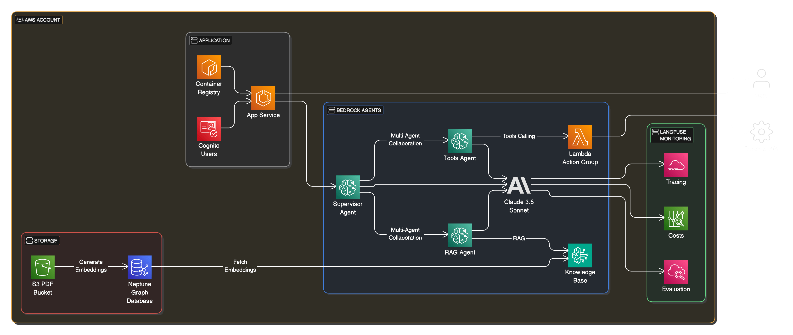

# AWS Bedrock Multi-Agent Blueprint

The AWS Bedrock Multi-Agent Blueprint is a project that allows you to create and deploy multi-agent applications on AWS Bedrock. It is built with the AWS CDK and offers advanced features such as agent collaboration, vector database storage, observability, authentication, and a Streamlit web interface.

Here is a video of the application in action:

<div align="left">
      <a href="https://www.youtube.com/watch?v=osjZSjEMR78">
     
      </a>
    </div>

## Table of Contents

- [AWS Bedrock Multi-Agent Blueprint](#aws-bedrock-multi-agent-blueprint)
  - [Table of Contents](#table-of-contents)
  - [Features](#features)
  - [Solution Design](#solution-design)
  - [Usage](#usage)
  - [Possible Improvements](#possible-improvements)
  - [Acknowledgements](#acknowledgements)
  - [Author](#author)

## Features

- 🤖 **Multi-Agent Architecture**: Built with AWS Bedrock Agents including a Supervisor Agent, RAG Agent and Tools Agent working together seamlessly as a multi-agent system
- 🔍 **Knowledge Base Integration**: Leverages AWS Bedrock Knowledge Base for intelligent processing of PDF documents via RAG
- 🔄 **Tools Calling Integration**: Custom Bedrock Action group for fetching and analyzing relevant clinical trials data from ClinicalTrials.gov using AWS Lambda
- 🧮 **Code Interpreter**: Built-in Code Interpreter capabilities for data analysis and visualization tasks that is able to generate images and HTML code
- 🎯 **Prompt Engineering**: Custom prompt templates and configurations for knowledge base responses and orchestration of the Bedrock Agents
- 📊 **Vector Database Storage**: Uses Amazon Aurora Vector Store for efficient storage and retrieval of embeddings for RAG
- 📈 **Observability**: Built-in monitoring and tracing with LangFuse integration for evaluation, tracing, and cost tracking
- 🛠️ **Infrastructure as Code**: Complete AWS CDK v2 for TypeScript setup with projen for consistent infrastructure management
- 🔐 **Authentication**: Integrated Cognito-based authentication system for secure access control to the application via username / password
- 💻 **Streamlit App**: Interactive web interface built with Streamlit for easy interaction with the agents deployed to AWS ECS Fargate
- 📚 **OpenAPI Schema**: Automatically generated from annotated code of your Lambda function using Lambda Powertools for Bedrock

## Solution Design



## Usage

- Login to your AWS account, go to AWS Bedrock Model catalog in eu-central-1 region and request access to the following models:
  - Titan Text Embeddings V2
  - Claude 3.5 Sonnet V1
- Eventually, you may need to increase your AWS account limits / service quota for Claude [as described here](https://docs.aws.amazon.com/bedrock/latest/userguide/quotas.html)
- Register a free LangFuse account for observability at [LangFuse](https://langfuse.com/) and create a new project called `multi-agent-blueprint`. Then create a new AWS Secret named `langfuse/api`  that stores the public and private API key as JSON:
  ```json
  {
    "LANGFUSE_PUBLIC_KEY": "<YOUR_PUBLIC_API_KEY>",
    "LANGFUSE_SECRET_KEY": "<YOUR_PRIVATE_API_KEY>"
  }
  ```
- Install [uv](https://docs.astral.sh/uv/) and [AWS CDK](https://docs.aws.amazon.com/cdk/latest/guide/getting_started.html) on your machine, then run the following commands:
  ```bash
  cd infra && npx projen && cd ../
  uv sync --frozen
  uv pip install -r src/app/requirements.dev.txt
  uv pip install -r src/tools/clinicaltrials/requirements.dev.txt
  ```
- Execute the following commands to deploy the infrastructure via AWS CDK:
  ```bash
  cd infra && cdk bootstrap
  DOCKER_DEFAULT_PLATFORM=linux/amd64 cdk deploy --require-approval never --all
  ```
- In the AWS Console under Bedrock Knowledge Bases, open the created knowledge base and make sure the data source sync is completed, otherwise trigger it manually
- Go to the AWS Console and create a new Cognito user with username and password. Use this to login to the Streamlit app over the HTTP URL that is printed out after the deployment is complete
- For local testing, set the Supervisor Agent ID and Alias ID as well as your LangFuse API keys in the `.vscode/launch.json` file, then run the `APP` launch configuration:
  ```json
  {
    "env": {
      "SUPERVISOR_AGENT_ID": "<YOUR_SUPERVISOR_AGENT_ID>",
      "SUPERVISOR_AGENT_ALIAS_ID": "<YOUR_SUPERVISOR_AGENT_ALIAS_ID>",
      "LANGFUSE_SECRET_KEY": "<YOUR_LANGFUSE_SECRET_KEY>",
      "LANGFUSE_PUBLIC_KEY": "<YOUR_LANGFUSE_PUBLIC_KEY>"
    }
  }
  ```
- To regenerate the OpenAPI schema from the annotated code of your Lambda function, run the `API SCHEMA` launch configuration. You can find an overview about the implemented functionality [in this PDF](./data/api/Clinical%20Trials%20Bedrock%20API.pdf).

## Possible Improvements
- Add end-to-end agent evaluation using a framework like [AWS Agent Evaluation](https://awslabs.github.io/agent-evaluation/) or [LangFuse Evaluation Pipelines](https://langfuse.com/docs/scores/external-evaluation-pipelines)
- Add a reranker to the knowledge base to improve the quality of the RAG responses as shown in [this code example](https://github.com/aws-samples/amazon-bedrock-samples/blob/main/rag/knowledge-bases/features-examples/02-optimizing-accuracy-retrieved-results/re-ranking_using_kb.ipynb)
- Split the application into frontend and backend using FastAPI for the backend server, similar to [this example](https://github.com/aws-samples/amazon-bedrock-samples/tree/main/rag/knowledge-bases/features-examples/03-deploying-fastapi-server) that does the same for LangGraph
- Use a prompt router for Anthropic to route the user's query to the most appropriate agent, as explained in [this example](https://github.com/awslabs/generative-ai-cdk-constructs/blob/main/src/cdk-lib/bedrock/README.md#prompt-routing)

## Acknowledgements

Big thank you to [Tamer Chowdhury](https://www.linkedin.com/in/tamer-chowdhury-9875684/) for the support and implementation of the [ClinicalTrials.gov Trial Connect functionality](https://huggingface.co/spaces/chowdhut/Trial-Connect).

## Author

Hi, I'm Max. I am a certified Senior IT Freelancer from Germany, supporting my clients remotely in different industries and roles. My focus areas are AWS Cloud, Data Engineering, DevOps Development and Artificial Intelligence. My working modes are high-level and hands-on, combined with an agile mindset to deliver high-quality, state-of-the-art solutions.

If you want to work with me on your next Agent project on AWS, please get in touch:

[](https://maxritter.net/)
[](mailto:mail@maxritter.net)
[](https://www.linkedin.com/in/rittermax/)
[](https://github.com/maxritter)
